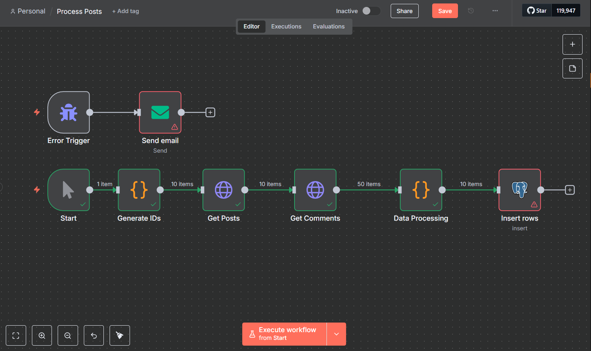

This repository contains an n8n workflow that:

Fetches posts (ID 1–10) from JSONPlaceholder
Fetches each post’s comments
Processes titles, bodies, comments per requirements
Inserts the final JSON into a Supabase PostgreSQL table

# 📂 Repo Structure
├── README.md

├── workflow.json

├── workflow-screenshot.png

├── sample-output.json

├── database-access.txt

└── database-credentials.md

# 🚀 Getting Started
## Prerequisites
- n8n v0.150+
- A Supabase project (free tier)
## 1. Import Workflow
- Open your n8n editor.
- Click Import → select workflow.json.
- You should see nodes: Generate IDs → Get Post → Get Comments → Process All → Supabase Insert.
## 2. Configure Supabase Credentials
- In n8n Credentials, add new Postgres credential.
- Enter host/port/db/user/password from database-credentials.md.
- Test and Save.
## 3. Run the Workflow
- Hit Execute Workflow in n8n.
- You should see 10 items processed, with each inserted into your Supabase table.
# 🗃️ Database Access
See `database-access.txt` for your connection details.

Use any SQL client (pgAdmin, psql, Supabase Studio) to verify the inserted rows.

# 📄 Sample Output
We’ve included sample-output.json which shows one processed post + its comments:
```
{
  "record_id": "POST_001",
  "content": { … },
  "metadata": { … },
  "analytics": { … },
  "comments": [ … ]
}
```
# ✅ Success Criteria
- 10 posts fetched, each with comments
- All processing rules applied (truncate, title‐case, word counts, tags, etc.)
- Data inserted into Supabase
- Read-only credentials provided
# 📸 Screenshots

